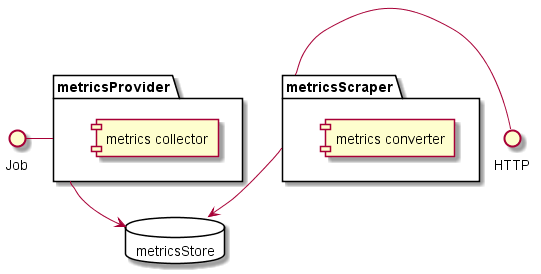
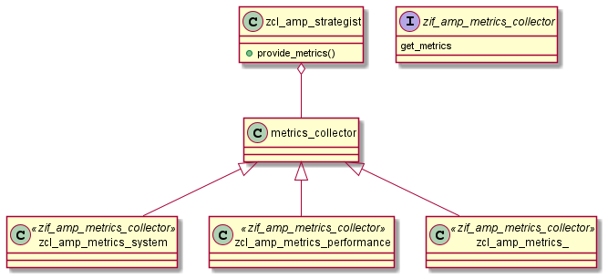
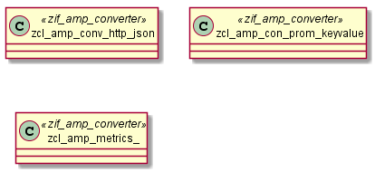

# abap-metrics-provider :construction: WIP

# architecture

## component diagramm

## class diagramm

### provider

### converter

# local tests

https://github.com/JohannesKonings/docker-abap-metrics-provider-tester

# based on
https://github.com/pacroy/abap-prometheus
