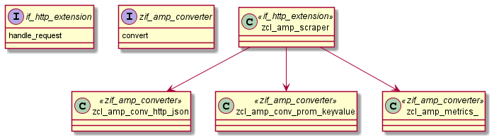

# abap-metrics-provider

# compatibility

[statement compatibility](https://abaplint.app/stats/abap-observability-tools/abap-metrics-provider/statement_compatibility)

# architecture

## component diagramm

## class diagramm

### provider

### scraper

# documentation

[documentation folder](docs/)
# local tests

[local test folder](local-tests/)

# based on
https://github.com/pacroy/abap-prometheus
