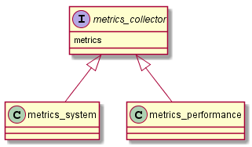

# abap-metrics-provider :construction: WIP

# architecture

## classdiagramm

# local tests
https://github.com/JohannesKonings/docker-influxdb-telegraf-grafana-stack-4-sap-netweaver

# based on
https://github.com/pacroy/abap-prometheus
